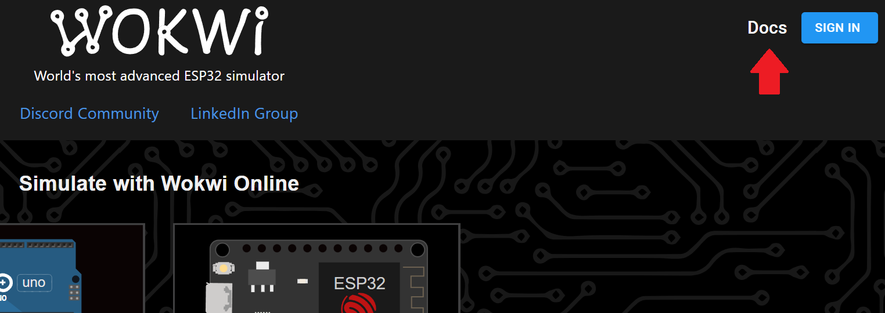

## Úlohy k MCU

### 2. Seznámení se simulátorem

1. V prohlížeči si otevřete některý z následujících simulátorů (případně vyhledejte nějaký další):

[Wokwi - simulátor: Arduina UNA, ESP32, Raspberry pi pico a STM32](https://wokwi.com/)

[Tinkercad -> circuits - simulátor: Erduino UNO a Micro:bit](https://www.tinkercad.com/circuits)

2. Pokud je potřeba, zaregistrujte se a založte projekt.
3. Napište program pro pulzování LED (plynule se LED rozsvěcí a následně plynule zhasíná). 

    
 :bulb: Tip: 

        Podívejte se na nápovědu, případně na tutoriály k těmto simulátorům. Wokwi má např.: 
        

    
 :bulb: Tip: 

        Při programování je vhodné rozdělit si úlohu na jednodušší části, které si vždy odzkoušíte.
        V tomto případě je vhodné nejprve najít a zprovoznit program na blikání LED. Následně se nabízí např. vyzkoušet PWM a cyklus for. A teprve poté zkombinovat nabité zkušenosti a vyřešit zadání. 
        Tento přístup je vhodné aplikovat i při práci s hardwarem. Tedy např. nejprve zapojíte část, kterou následně odzkoušíte, tzv. oživíte. Přidáte další, atd. Tím omezíte počet možných chyb a lépe se vám budou případné chyby hledat.

4. Především, pokud použijete chatbota, zkontrolujte program, zda je optimalizován. V současné době i chatboty specializované na programování (např. GitHub Copilot) často generují zbytečný kód, navíc dělají chyby v logice programu.

> :key: **PWM**
>
> Pulzně šířková modulace (Pulse-Width Modulation)
> Používá se v číslicové technice k řízení např. jasu LED, otáček motorů, apod. I když spojitá změna napětí, případně proudu má své výhody, je k ní potřeba DAC (digitálně analogový převodník), což je poměrně složitý a pomalý obvod. PWM je v tomto případě jednodušší na realizaci, využívá digitální výstup a čítač. 
> 
> Příklad v Arduino language
> Arduino Uno R4 WiFi LESSON 11: Pulse Width Modulation (PWM) Simulation of Analog Voltages. Online. 2024. Dostupné z: https://youtu.be/4QUH5D_6XVc?feature=shared. [cit. 2025-02-01].
> 
> Příklad v micropythonu
> Raspberry Pi Pico W LESSON 9: Getting Analog Output Using PWM (Pulse Width Modulation). Online. 2023. Dostupné z: https://youtu.be/GXA1Y6lA14A?feature=shared. [cit. 2025-02-01].
> 
> Raspberry Pi Pico: PWM slábnutí LED (MicroPython). Online. In: 2023. Dostupné z: https://randomnerdtutorials.com/raspberry-pi-pico-pwm-micropython/. [cit. 2025-02-01].

### 3. Přechod pro chodce

1. K mikrořadiči připojte tlačítko a LED na některé z digitálních pinů (GPIO). Způsob jak je zapojit máte v následujících pojmech digitální vstup a výstup.

> :key: **Digitální vstup**
>
> [Příklad zapojení tlačítka.](../DI.md)

> :key: **Digitální výstup**
>
> [Příklad zapojení LED.](../DO.md)

2. Nastavte pin, na kterém je tlačítko jako digitální vstup s pull-up rezistorem, a pin s LED na digitální výstup.
3. Nejprve napište testovací program, který rozsvítí LED, když je stisknuté tlačítko a zhasne ji, když tlačítko uvolníte. Všimněte si, že je tam někde obrácená logika. Zkuste zjistit, kde a čím je to dáno. A zkuste vymyslet, jak softwarově logiku obrátit.
4. Do předešlého programu zakomponujte paměť pro uložení stavu tlačítka a upravte program tak, aby jedním stisknutím tlačítka se LED rozsvítila a následujícím zhasla.
5. Rozšiřte tento program o další LED a naprogramujte přechod pro chodce se semafory, viz obrázek:

Fotka světelného semaforu ve Slatině u MŠ, printsceen z mapy.cz

    
 :bulb: Tip: 

        Pokud máte problém s detekcí stisknutého tlačítka, zkuste následující možnosti:  
        - Pokud používáte time.sleep() nebo delay_ms(), nahraďte je vnitřním časovačem, viz níže.
        - Druhou možností je použít pro tlačítko interrupt z vnějšího pinu.

> :key: **Vnější (hardwarové) přerušení**
> 
> V našem případě používáme přerušení z vnějšího pinu, které patří mezi vnější (hardwarová) přerušení, více viz
> 
> Přerušení. Online. In: Wikipedia: the free encyclopedia. San Francisco (CA): Wikimedia Foundation, 2007, 17. 7. 2023. Dostupné z: https://cs.wikipedia.org/wiki/P%C5%99eru%C5%A1en%C3%AD. [cit. 2025-02-02].
> 
> Příklad v Micropythonu
> Raspberry Pi Pico W LESSON 83: Using Interrupts in Micropython. Online. In: . 2024. Dostupné z: https://youtu.be/GxtQJmvhsvs?feature=shared. [cit. 2025-02-02].

> :key: **Vnitřní časovač**
>
> Spouští se poté, co mikrořadič naběhne z resetu, obvykle využívá jeden z hardwarových čítačů mikrořadiče, a po určité době přeteče (resetuje se).
> 
> V Arduino language z něj můžeme číst hodnotu pomocí funkce millis()
> 
> V Micropythonu z něj můžeme číst hodnotu pomocí ticks_ms() z knihovny time. Více viz
> Time – time related functions¶. Online. In: . 29 Jan 2025. Dostupné z: https://docs.micropython.org/en/latest/library/time.html. [cit. 2025-02-03].

### 4. Blikačka na kolo

1. Napište program pro blikačku na kolo s minimálně čtyřmi režimy, mezi nimiž přepínejte pomocí tlačítka.

    
 :bulb: Tip: 

        Použijte stejný základ jako pro semafor.

    
 :bulb: Tip: 

        Zadání si zkuste rozdělit na jednodušší části, které lze samostatně zprovoznit a odladit.

