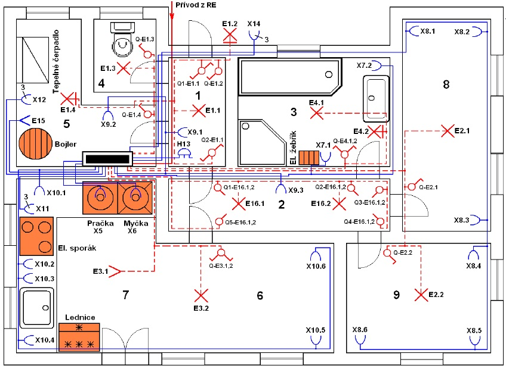

## Úlohy

### 1. Seznámení se simulátorem

1. Založte v programovacím prostředí nový projekt.
2. Napište/vytvořte program ve zvoleném jazyce pro ověření funkcí AND, NOR a XOR pro dvě vstupní proměnné.
3. Nastavte simulátor, přeložte a nahrajte do něj program.
4. Program odzkoušejte, případně upravte a nahrajte znovu.

    
 :bulb: Tip: 

        Při programování je vhodné rozdělit si úlohu na jednodušší části, které si vždy odzkoušíte.
        V tomto případě nejprve založte program a následně jej prázdný nahrajte do simulátoru. 
        Až budete pracovat s hardwarem, bude postup skoro stejný, jen po založení projektu načtete hardwarovou konfiguraci PLC a poté prázdný program nahrajete.
        Tento postup vám pomůže vyloučit případné chyby ze založení projektu a načtení HW konfigurace.

### 2. Složitější program v simulátoru

1. Vyhledejte na internetu půdorys bytu/domu (zazálohujte si neupravenou podobu, možná se vám bude později hodit).
2. Vyznačte v něm rozmístění světel, tlačítkových ovladačů, ventilátoru, senzoru pohybu a žaluzií nebo venkovních rolet.
3. Napište/sestavte program pro ovládání:
    - Alespoň jednoho světla minimálně ze dvou míst
    - Světla/ventilárotu, který se sepne tlačítkem/senzorem pohybu a vypne automaticky po uplynutí nastaveného času
    - Žaluzií/venkovních rolet.
4. Program odzkoušejte a případně opravte.

    
 :bulb: Tip: 

        Svítidla a ovládací prvky můžete zakreslit podle následujícího příkladu: 
        

    
 :bulb: Tip: 

        Ovládací prvky nejsou spínače, jako u domovní elektroinstalace, ale tlačítka, která se po uvolnění vrátí zpět. Pošlou tedy jen impulz různé délky. Pokud byste počítali se spínači a přepínači, připravili byste se o velký potenciál PLC.

    
 :bulb: Tip: 

        Jak ovládat žaluzie/rolety lze zjistit např. z násedujících technických listů: 
        Informace k motorům a jejich zapojení je na stranách 24 až 28 a 30 (dole):  
            - ROLOVACÍ SYSTÉMY, Technické listy. Online. 2024, s. 56. Dostupné z: https://profisekce.lomax.cz:7001/sharing/R1OQgzvRh. [cit. 2024-12-30]. 
        Informace k modulům na ovládání rolet/žaluzií:  
            - Ovládání asynchronních motorů pro žaluzie, markýzy, C-JC-0006M. Online. In: Teco Wiki. Kolín: Teco, 20.02.2020 17:48. Dostupné z: https://wiki.tecomat.cz/clanek/711-ovladani-asynchronnich-motoru-pro-zaluzie-markyzy-c-jc-0006m. [cit. 2024-12-31]. 
            - Ovládání asynchronních motorů pro žaluzie, markýzy, C-JC-0201B. Online. In: Teco Wiki. Kolín: Teco, 20.02.2020 17:53. Dostupné z: https://wiki.tecomat.cz/clanek/712-ovladani-asynchronnich-motoru-pro-zaluzie-markyzy-c-jc-0201b. [cit. 2024-12-31].

### 3. Vizualizace

1. Váš program doplňte o vizualizaci. Na pozadí dejte váš půdoryr, ale bez schématických značek zařízení. Ty nahraďte vhodnými aktivními ikonami.

    
 :bulb: Tip: 

        Pro vizualizaci se můžete inspirovat např. náhledy v následujícím článku:  
        Kompletní systém řízení a vizualizace technologií rodinného domu v Kroměříži. Online. In: . Kolín: Teco, 2010. Dostupné z: https://www.tecomat.cz/reference/inteligentni-dum/kompletni-system-rizeni-a-vizualizace-technologii-rodinneho-domu-v-kromerizi-137/. [cit. 2024-12-31].

### 4. Nahrání programu do PLC

1. Navrhněte (nakreslete schéma a v případě potřeby podložte výpočty) zapojení LED a tlačítka k PLC.
2. Zapojte k PLC tlačítka a kontrolky, případně další prvky (podle možností).
3. Program z úlohy 2 a vizualizaci z úlohy 3 upravte pro PLC tak, abyste měli alespoň ovládání:
    - Světla z více míst
    - Zpožděné vypnutí světla (tlačítkem nebo senzorem pohybu se rozsvítí a po nastavené do bě zhasne) nebo zpožděné vypnutí ventilátoru (např. na WC, kdy s rozsvícením světla se zapne i ventilátor, ale vypne se až nastavený čas po zhasnutí světla)
    - Žaluzie/venkovní rolety pomocí dvou tlačítek (up/down) s rozlišením délky stisknutí (krátký stisk: jede až do koncové polohy, dlouhý stisk: po dobu stisknutí jede, po uvolnění se automaticky zastaví), koncové spínače a případná ochrana je součástí motoru
4. Vše nahrajte do PLC a odzkoušejte a to včetně vizualizace.
5. Nastavte přihlašovací údaje a vyzkoušejte vizualizaci v prohlížeči.

    
 :bulb: Tip: 

        Příklad zapojení tlačítka:
        --- doplnit zapojení sink/source vč. schématu

    
 :bulb: Tip: 

        Příklad zapojení LED:
        --- doplnit o zapojení sink/source vč. schématu a výpočtu předřad. R

<!--

> :key: **Safety**
>
> Ve s

V tématu regulace zadat, aby do půdorysu přidali vytápění.. 

Diagnostika na vlastní úlozes  PLC

-->